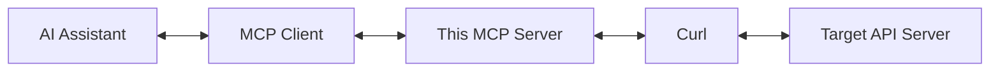
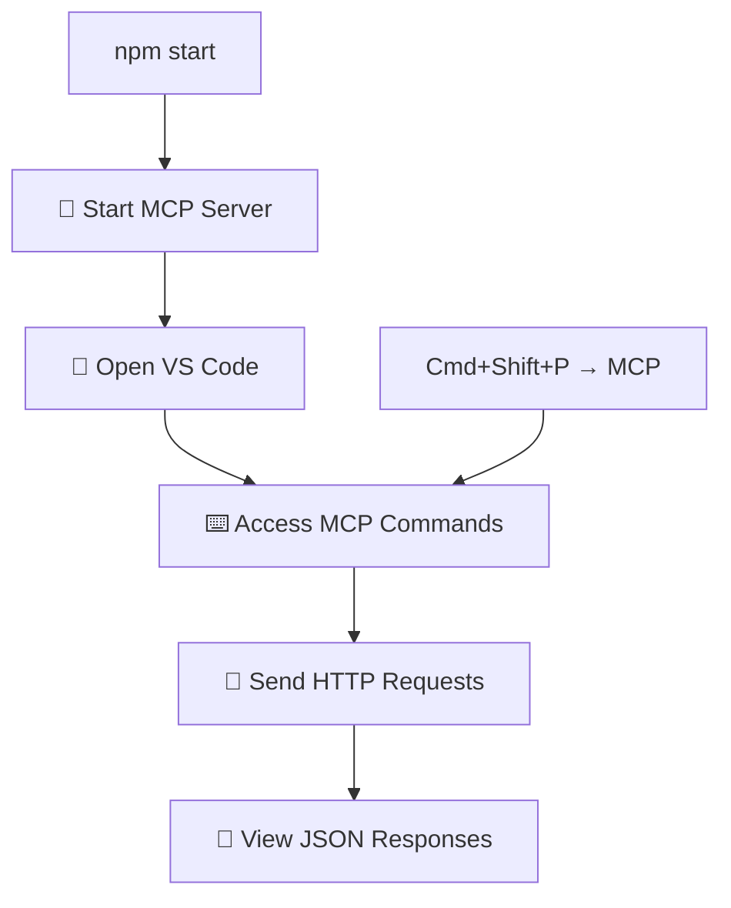

# 🌐 MCP HTTP Proxy

> A powerful **Model Context Protocol (MCP)** server that provides HTTP request proxying for AI applications. All responses are structured for AI consumption with consistent status, data, and error fields.

---

## 📋 Repository Information

| Field | Value |
|-------|-------|
| **🔗 GitHub** | [akhshyganesh/mcp-http-proxy](https://github.com/akhshyganesh/mcp-http-proxy) |
| **👤 Author** | Akhshy Ganesh ([akhshy.balakannan@gmail.com](mailto:akhshy.balakannan@gmail.com)) |
| **📄 License** | MIT License |
| **🔖 Version** | 1.0.0 |
| **📦 Package** | `mcp-http-proxy` |

## 🤖 What is MCP?

The **Model Context Protocol (MCP)** is an open standard that enables secure connections between AI applications and external data sources. This server implements MCP to provide AI assistants with the ability to perform HTTP operations against external APIs through a standardized interface.

---

## ✨ Features

- 🌐 **HTTP Request Proxying**: Support for GET, POST, PUT, DELETE methods to external APIs
- 🖥️ **Curl Proxy**: Uses system curl commands to communicate with target servers
- 🤖 **AI-Friendly Responses**: Structured JSON responses with status, HTTP code, data, and error fields
- 🛡️ **Intelligent Error Handling**: Provides helpful guidance for common HTTP errors (401, 403, 429, etc.)
- ✅ **Schema Validation**: Input validation using Zod schemas
- 🔒 **Security**: Built-in timeout protection and input sanitization to prevent command injection
- 📘 **TypeScript**: Fully typed implementation with the MCP SDK

---

## 🏗️ Architecture



The server receives MCP requests, validates input, constructs curl commands, executes them, and returns structured responses.

## 🚀 Installation & Setup

### 📦 For End Users (Recommended)

#### Option 1: Install from NPM (Easiest)
```bash
# Install globally to use anywhere
npm install -g mcp-http-proxy

# Start the server
mcp-http-proxy
```

#### Option 2: Install from GitHub
```bash
# Install directly from the repository
npm install -g git+https://github.com/akhshyganesh/mcp-http-proxy.git

# Start the server
mcp-http-proxy
```

#### Option 3: Use with npx (No Installation)
```bash
# Run directly without installing
npx mcp-http-proxy
```

### 🛠️ For Developers

#### 1️⃣ Clone and Install Dependencies
```bash
git clone https://github.com/akhshyganesh/mcp-http-proxy.git
cd mcp-http-proxy
npm install
```

#### 2️⃣ Build the Project
```bash
npm run build
```

#### 3️⃣ Start the Server
```bash
npm start
# or for development with auto-reload
npm run dev
```

---

## 🔧 MCP Client Configuration

Once installed, you can use this server with any MCP-compatible client. Here are example configurations:

### Claude Desktop Configuration
Add to your `claude_desktop_config.json`:
```json
{
  "mcpServers": {
    "mcp-http-proxy": {
      "command": "mcp-http-proxy"
    }
  }
}
```

### VS Code MCP Extension
Add to your `.vscode/mcp.json`:
```json
{
  "mcpServers": {
    "mcp-http-proxy": {
      "command": "mcp-http-proxy"
    }
  }
}
```

---

## 🛠️ Development

### 📜 Available Scripts

| Command | Description |
|---------|-------------|
| `npm run build` | 🔨 Compile TypeScript to JavaScript |
| `npm start` | ▶️ Start the compiled server |
| `npm run dev` | 👀 Watch mode for development (auto-recompile on changes) |
| `npm run clean` | 🧹 Remove compiled files |
| `npm test` | 🧪 Run test suite |
| `npm run test:watch` | 🔍 Run tests in watch mode |
| `npm run test:coverage` | 📊 Run tests with coverage report |
| `npm run lint` | 🔍 Check code style and quality |
| `npm run lint:fix` | 🔧 Fix linting issues automatically |

### 📁 Project Structure

```
├── 📂 src/
│   ├── 📄 index.ts              # Main MCP server implementation
│   └── 📂 @types/               # Custom type declarations
│       └── 📄 modelcontextprotocol__sdk.d.ts
├── 📂 tests/                    # Test files
│   ├── 📄 server.test.ts        # Server functionality tests
│   └── 📄 setup.ts              # Test setup configuration
├── 📂 dist/                     # Compiled JavaScript (generated, not tracked)
├── 📂 .vscode/
│   ├── 📄 mcp.json             # VS Code MCP integration config
│   └── 📄 tasks.json           # VS Code build tasks
├── 📂 .github/
│   └── 📂 workflows/
│       └── 📄 ci.yml           # Continuous Integration pipeline
├── 📄 jest.config.js           # Jest testing configuration
├── 📄 .eslintrc.js             # ESLint configuration
├── 📄 .npmignore               # NPM package exclusions
│   └── 📄 copilot-instructions.md # GitHub Copilot workspace instructions
├── 📄 test-requests.json        # Sample test requests
├── 📄 test-requests.md          # Test requests documentation
├── 📄 package.json              # Project dependencies and scripts
├── 📄 tsconfig.json            # TypeScript configuration
├── 📄 tsconfig.build.json      # TypeScript build configuration
├── 📄 .gitignore               # Git ignore patterns
├── 📄 LICENSE                  # MIT license file
└── 📄 README.md               # This file
```

---

## 📖 Usage

### 📥 Input Schema

The server accepts requests with the following structure:

```typescript
interface Request {
  method: 'GET' | 'POST' | 'PUT' | 'DELETE';
  url: string;                    // Valid URL
  data?: Record<string, any>;     // Request body (for POST/PUT)
  headers?: Record<string, string>; // HTTP headers
}
```

### 📤 Response Schema

All responses follow this structure:

```typescript
interface Response {
  status: 'ok' | 'error';
  code: number;                   // HTTP status code
  data: any;                      // Response body (parsed JSON if possible)
  error?: string;                 // Error message (if status is 'error')
}
```

### 💡 Examples

#### 📋 GET Request
```json
{
  "method": "GET",
  "url": "https://api.example.com/users/123",
  "headers": {
    "Authorization": "Bearer token123"
  }
}
```

#### ➕ POST Request
```json
{
  "method": "POST",
  "url": "https://api.example.com/users",
  "headers": {
    "Content-Type": "application/json"
  },
  "data": {
    "name": "John Doe",
    "email": "john@example.com"
  }
}
```

#### ✅ Success Response
```json
{
  "status": "ok",
  "code": 200,
  "data": {
    "id": 123,
    "name": "John Doe",
    "email": "john@example.com"
  }
}
```

#### ❌ Error Response
```json
{
  "status": "error",
  "code": 401,
  "data": {
    "message": "Unauthorized"
  },
  "error": "Authentication required (HTTP 401). The API endpoint requires authentication. Please provide an Authorization header (e.g., \"Authorization\": \"Bearer YOUR_TOKEN\" or \"Authorization\": \"Basic YOUR_CREDENTIALS\"). Check the API documentation for the correct authentication method."
}
```

## 🚨 Intelligent Error Handling

The server provides helpful guidance for common HTTP errors:

| Status | Error | Guidance |
|--------|-------|----------|
| **401** | 🔒 Unauthorized | Suggests adding authentication headers with examples |
| **403** | ⛔ Forbidden | Explains permission issues and troubleshooting steps |
| **429** | ⏰ Rate Limited | Recommends waiting and implementing backoff strategies |
| **400** | ❌ Bad Request | Guides on fixing request format and validation issues |
| **404** | 🔍 Not Found | Helps verify URLs and resource existence |
| **5xx** | 🛠️ Server Errors | Advises on retry strategies and temporary issues |

Each error response includes specific, actionable guidance to help resolve the issue quickly.

---

## 💻 VS Code Integration

### 🔧 Setting Up MCP in VS Code

#### 1️⃣ Install an MCP Extension
Install one of these MCP extensions in VS Code:

```
📦 automatalabs.copilot-mcp
📦 buildwithlayer.mcp-integration-expert-eligr  
📦 semanticworkbenchteam.mcp-server-vscode
```

#### 2️⃣ Configure MCP Settings
The `.vscode/mcp.json` file is already configured:

```json
{
  "servers": {
    "curl": {
      "type": "stdio",
      "command": "node",
      "args": ["dist/index.js"]
    }
  }
}
```

#### 3️⃣ Build and Start
```bash
npm run build
npm start
```

#### 4️⃣ Use in VS Code
Open VS Code's command palette (`Cmd+Shift+P`) and look for MCP-related commands to interact with your server.

### 🧪 Testing with Dummy Endpoints

Here are some free JSON API endpoints you can use for testing:

#### 🏷️ JSONPlaceholder (Fake REST API)
- **🌐 Base URL**: `https://jsonplaceholder.typicode.com`
- **📋 Features**: Users, Posts, Comments, Albums, Photos, Todos

#### 🔬 Example Requests to Test Your MCP Server

<details>
<summary><strong>1️⃣ GET Users</strong></summary>

```json
{
  "method": "GET",
  "url": "https://jsonplaceholder.typicode.com/users"
}
```
</details>

<details>
<summary><strong>2️⃣ GET Single User</strong></summary>

```json
{
  "method": "GET",
  "url": "https://jsonplaceholder.typicode.com/users/1"
}
```
</details>

<details>
<summary><strong>3️⃣ CREATE Post</strong></summary>

```json
{
  "method": "POST",
  "url": "https://jsonplaceholder.typicode.com/posts",
  "headers": {
    "Content-Type": "application/json"
  },
  "data": {
    "title": "My New Post",
    "body": "This is the content of my post",
    "userId": 1
  }
}
```
</details>

<details>
<summary><strong>4️⃣ UPDATE Post</strong></summary>

```json
{
  "method": "PUT",
  "url": "https://jsonplaceholder.typicode.com/posts/1",
  "headers": {
    "Content-Type": "application/json"
  },
  "data": {
    "id": 1,
    "title": "Updated Post Title",
    "body": "Updated post content",
    "userId": 1
  }
}
```
</details>

<details>
<summary><strong>5️⃣ DELETE Post</strong></summary>

```json
{
  "method": "DELETE",
  "url": "https://jsonplaceholder.typicode.com/posts/1"
}
```
</details>

#### 🌐 Other Test APIs

| API | Description | Example Endpoints |
|-----|-------------|-------------------|
| **HTTPBin** | HTTP testing service | `https://httpbin.org/get`, `https://httpbin.org/post` |
| **ReqRes** | Fake user API | `https://reqres.in/api/users`, `https://reqres.in/api/users/2` |

### 🔄 VS Code Usage Workflow



1. **🚀 Start the MCP Server**: Run `npm start` in your terminal
2. **📖 Open VS Code**: Open any file or workspace
3. **⌨️ Access MCP Commands**: Use `Cmd+Shift+P` → Search for "MCP"
4. **📨 Send Requests**: Use the MCP interface to send HTTP requests through your server
5. **👀 View Responses**: See structured JSON responses in VS Code

### 🧪 Testing Commands

The repository includes a comprehensive `test-requests.json` file with sample requests for testing all HTTP operations. For detailed information about each test request, see [test-requests.md](test-requests.md).

> **📋 Test Coverage Includes:**
> - **JSONPlaceholder API**: Users and Posts HTTP operations
> - **HTTPBin API**: HTTP testing with custom headers  
> - **ReqRes API**: User API with pagination

You can use these test requests directly with your MCP client to verify the server functionality.

---

## 🔒 Security Considerations

| Security Feature | Description |
|-------------------|-------------|
| **✅ Input Validation** | All inputs are validated using Zod schemas |
| **🛡️ Command Injection Prevention** | Input sanitization prevents curl command injection attacks |
| **⏰ Timeout Protection** | Built-in timeouts (30s max, 10s connect) prevent hanging requests |
| **🌐 Network Access** | This server can make arbitrary HTTP requests - ensure proper network policies |
| **🔑 Headers** | Be careful with sensitive headers like API keys |
| **📊 Rate Limiting** | The server includes guidance for handling API rate limits appropriately |

---

## 🔧 Troubleshooting

### ⚠️ Common Issues

<details>
<summary><strong>🚫 "Cannot find module dist/index.js"</strong></summary>

**Solution:**
- Run `npm run build` to compile TypeScript to JavaScript
- The `dist/` directory will be created automatically during build
- Note: The `dist/` folder is not tracked in git as it contains compiled output
- Check that `tsconfig.json` has `"outDir": "./dist"` and `"rootDir": "./src"`
</details>

<details>
<summary><strong>🔴 TypeScript Compilation Errors</strong></summary>

**Solution:**
Ensure all dependencies are installed (`npm install`)
</details>

<details>
<summary><strong>📘 MCP SDK Types</strong></summary>

**Solution:**
Custom type declarations are provided in `src/@types/`
</details>

<details>
<summary><strong>🖥️ Curl Not Found</strong></summary>

**Solution:**
Ensure curl is installed on your system
</details>

<details>
<summary><strong>🌐 Network Errors</strong></summary>

**Solution:**
Check target server accessibility and network policies
</details>

<details>
<summary><strong>🔒 Authentication Errors (401/403)</strong></summary>

**Solutions:**
- Verify API keys and tokens are correct
- Check if headers are properly formatted  
- Ensure your account has the required permissions
</details>

<details>
<summary><strong>⏰ Rate Limiting (429)</strong></summary>

**Solutions:**
- Implement delays between requests
- Use exponential backoff strategies
- Check API documentation for rate limit policies
</details>

<details>
<summary><strong>⏱️ Timeout Errors</strong></summary>

**Solutions:**
- Server requests timeout after 30 seconds for safety
- Check if the target API is responding slowly
- Consider if the endpoint requires different timeout settings
</details>

### 💡 Development Tips

- 👀 Use `npm run dev` for watch mode during development
- 🔍 Check VS Code problems panel for TypeScript errors
- 🚀 Test with simple GET requests first
- ✅ Validate JSON responses from target servers

## 🤝 Contributing

We welcome contributions to improve the MCP HTTP Proxy server! Here's how you can contribute:

### 🚀 Quick Start

1. **🍴 Fork the repository** on GitHub: [akhshyganesh/mcp-http-proxy](https://github.com/akhshyganesh/mcp-http-proxy)
2. **🌿 Create a feature branch**: `git checkout -b feature/your-feature-name`
3. **✨ Make your changes** and ensure they follow the existing code style
4. **🧪 Add tests** if applicable
5. **💾 Commit your changes**: `git commit -am 'Add some feature'`
6. **📤 Push to the branch**: `git push origin feature/your-feature-name`
7. **🔄 Submit a pull request** through GitHub

### 📋 Development Guidelines

- ✅ Follow TypeScript best practices
- 📝 Use meaningful commit messages
- 📚 Update documentation for new features
- 🏗️ Ensure all builds pass before submitting PR

---

## 📚 References

- 📖 [Model Context Protocol Documentation](https://modelcontextprotocol.io/llms-full.txt)
- 🛠️ [MCP SDK Reference](https://github.com/modelcontextprotocol/create-python-server)
- 📘 [TypeScript Documentation](https://www.typescriptlang.org/docs/)
- ✅ [Zod Schema Validation](https://zod.dev/)

---

## 🧪 Testing

### Running Tests

```bash
# Run all tests
npm test

# Run tests in watch mode
npm run test:watch

# Run tests with coverage
npm run test:coverage
```

### Test Coverage

The test suite includes:
- ✅ **Server startup tests** - Ensures the server starts without crashing
- ✅ **Executable validation** - Verifies CLI binary has correct shebang
- ✅ **Module import tests** - Confirms the module can be imported
- ✅ **Build verification** - Validates TypeScript compilation

### Continuous Integration

GitHub Actions automatically:
- ✅ Runs tests on multiple Node.js versions (18, 20, 22)
- ✅ Tests on multiple platforms (Ubuntu, Windows, macOS)
- ✅ Performs security audits
- ✅ Validates code quality with ESLint

---

## 🔒 Security

### Security Features

- ✅ **Input Sanitization** - All user inputs are validated and sanitized
- ✅ **Command Injection Protection** - Safe curl command construction
- ✅ **Timeout Protection** - Prevents hanging requests
- ✅ **Error Handling** - Secure error messages without sensitive data
- ✅ **Dependency Scanning** - Regular security audits of dependencies

### Security Auditing

```bash
# Run security audit
npm audit

# Fix security issues
npm audit fix

# Check for high-severity vulnerabilities
npm audit --audit-level=high
```

### Reporting Security Issues

If you discover a security issue, please:

1. **DO NOT** open a public GitHub issue
2. Email security concerns to: [akhshy.balakannan@gmail.com](mailto:akhshy.balakannan@gmail.com)
3. Include details about the vulnerability
4. Allow time for the issue to be addressed before public disclosure

---

## 🤝 Contributing

### Development Workflow

1. **Fork** the repository
2. **Clone** your fork locally
3. **Install** dependencies: `npm install`
4. **Build** the project: `npm run build`
5. **Run tests**: `npm test`
6. **Make changes** and add tests
7. **Lint code**: `npm run lint:fix`
8. **Create** a pull request

### Code Quality Standards

- ✅ All code must pass TypeScript compilation
- ✅ All tests must pass
- ✅ Code coverage should not decrease
- ✅ ESLint rules must be followed
- ✅ Security audit must pass

---

## 📄 License

This project is licensed under the **MIT License** - see the [LICENSE](LICENSE) file for details.

---

<div align="center">

### 🌟 Made with ❤️ by [Akhshy Ganesh](https://github.com/akhshyganesh)

**⭐ Star this repo if you found it helpful!**

</div>
